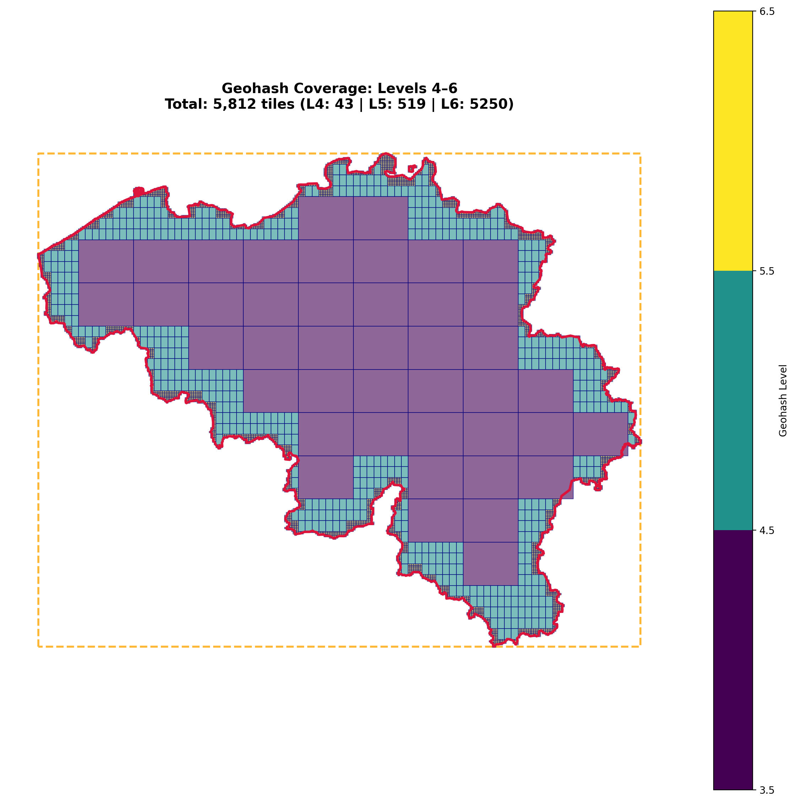
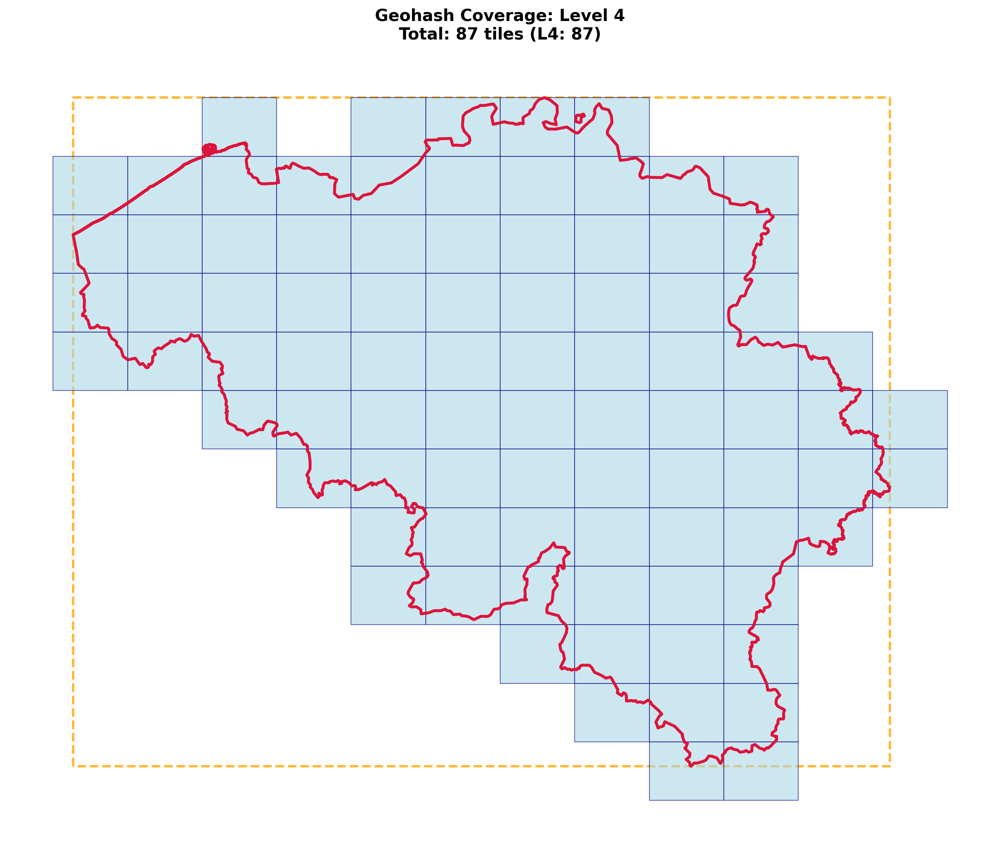
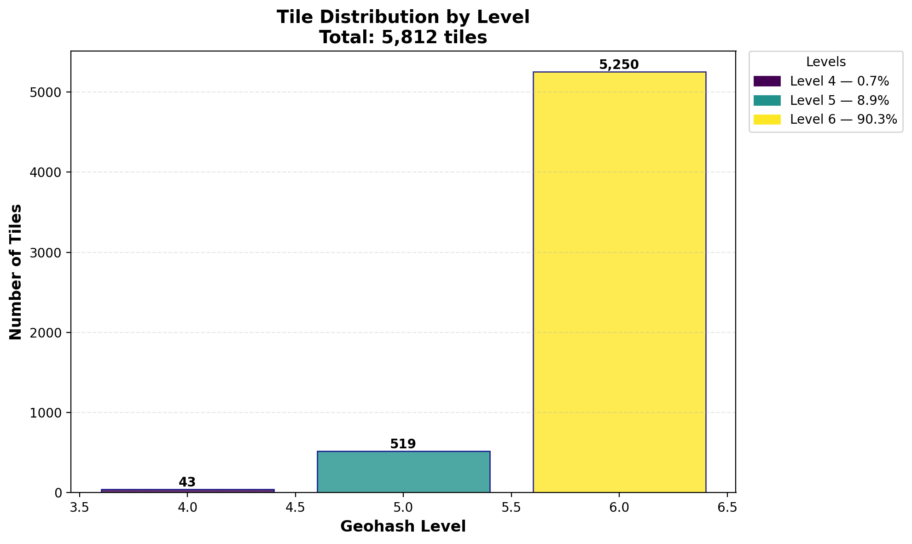
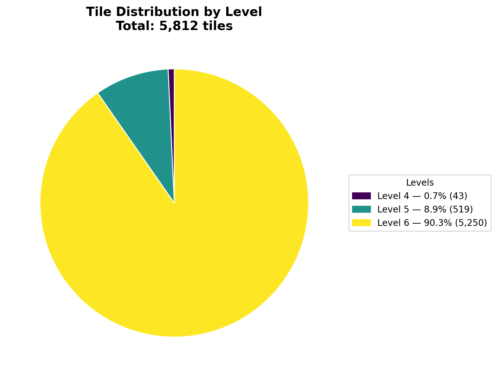
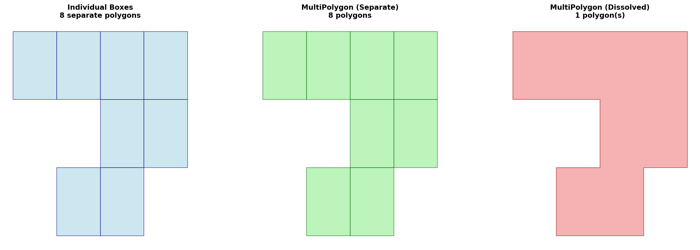
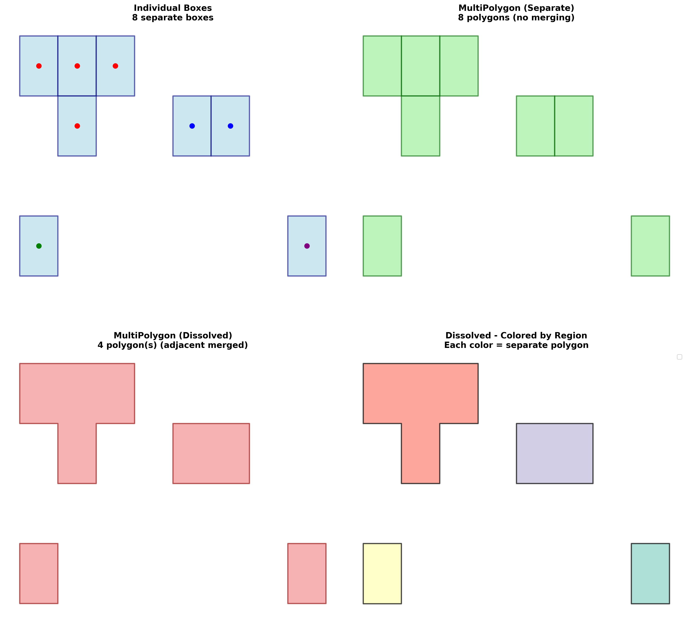
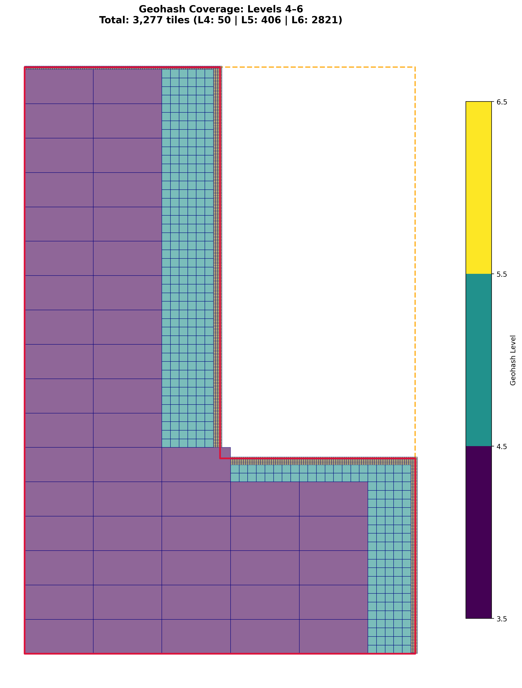
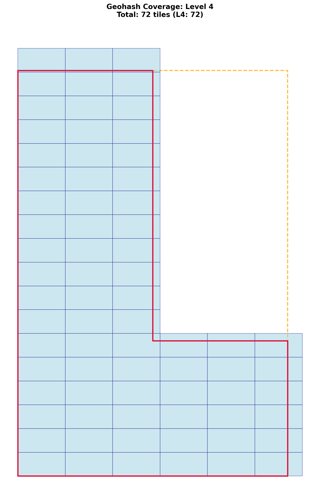

Examples
========

This page provides practical examples demonstrating common use cases with real code from the package.

Basic Example: Adaptive and Single-Level Coverage
--------------------------------------------------

Download a country and generate both adaptive and single-level geohash coverage:

.. code-block:: python

   from shapely import MultiPolygon, Polygon
   from sigmap.polygeohasher import download_gadm_country, build_single_multipolygon, \
       adaptive_geohash_coverage, plot_geohash_coverage, geohash_coverage
   from sigmap.polygeohasher.plot_geohash_coverage import plot_level_statistics

   # Download Belgium
   country_gdf = download_gadm_country("BEL", cache_dir='./gadm_cache')

   # Build geometry
   country_geom = build_single_multipolygon(country_gdf)

   # Generate adaptive coverage
   geohash_dict, tiles_gdf = adaptive_geohash_coverage(country_geom, 2, 6)

   # Plot the adaptive coverage map
   plot_geohash_coverage(
       country_geom, geohash_dict, tiles_gdf,
       style='adaptive',
       save_path='./generated_plot/adaptive_coverage.png',
   )

   # Plot tile repartition statistics
   plot_level_statistics(
       geohash_dict,
       style='bar',
       save_path='./generated_plot/level_stats_bar.png'
   )
   plot_level_statistics(
       geohash_dict,
       style='pie',
       save_path='./generated_plot/level_stats_pie.png'
   )

   # Generate single-level coverage
   geohash_dict_single = geohash_coverage(country_geom, level=4)

   # Plot single-level coverage
   plot_geohash_coverage(
       country_geom, geohash_dict_single,
       style='single',
       save_path='./generated_plot/single_coverage.png',
   )

**Result:**

**Statistics:**

Comparing Coverage Types
------------------------

Count tiles per coverage type for both adaptive and single-level:

.. code-block:: python

   from sigmap.polygeohasher import download_gadm_country, build_single_multipolygon, \
       adaptive_geohash_coverage, geohash_coverage

   def counting_tiles_per_coverage(geom, min_level, max_level):
       # Adaptive coverage from min to max
       geohash_dict, tiles_gdf = adaptive_geohash_coverage(
           geom,
           min_level=min_level,
           max_level=max_level,
           use_strtree=True,
       )

       print("=== MIN-MAX LEVEL RESULTS ===")
       for key in sorted(geohash_dict.keys()):
           print(f"Level {key}: {len(geohash_dict[key])} tiles")
       print(f"Total tiles: {sum(len(v) for v in geohash_dict.values())}")

       # Single level
       geohash_dict_single_level = geohash_coverage(
           geom,
           level=2,
           use_strtree=True,
           debug=True
       )

       print("\n=== SINGLE LEVEL RESULTS ===")
       for key in sorted(geohash_dict_single_level.keys()):
           print(f"Level {key}: {len(geohash_dict_single_level[key])} tiles")

   # Use with country
   ISO3 = "BEL"
   MIN_LEVEL = 2
   MAX_LEVEL = 5
   CACHE_DIR = './gadm_cache'

   country_dataframe = download_gadm_country(ISO3, cache_dir=CACHE_DIR)
   country_geometry = build_single_multipolygon(country_dataframe)
   counting_tiles_per_coverage(country_geometry, MIN_LEVEL, MAX_LEVEL)

Working with Geohash Conversions
----------------------------------

Convert geohashes to boxes and MultiPolygons:

.. code-block:: python

   from sigmap.polygeohasher import (
       geohashes_to_boxes,
       geohashes_to_multipolygon,
       get_geohash_children
   )

   # Single geohash to box
   geohash = "u4pruyd"
   boxes = geohashes_to_boxes(geohash)
   print(f"Geohash: {geohash}")
   print(f"Box polygon: {boxes[geohash]}")
   print(f"Bounds (lon_min, lat_min, lon_max, lat_max): {boxes[geohash].bounds}")
   print(f"Area: {boxes[geohash].area:.10f} square degrees")

   # Multiple geohashes to boxes
   geohashes = ["u4pru", "u4prv", "u4prw", "u4pry"]
   boxes = geohashes_to_boxes(geohashes)
   print(f"\nNumber of geohashes: {len(geohashes)}")
   print(f"Number of boxes: {len(boxes)}")
   for gh, box in boxes.items():
       print(f"  {gh}: bounds = {box.bounds}")

   # Get children geohashes
   parent = "u4pr"
   children = get_geohash_children(parent)[:8]  # First 8 children
   print(f"\nParent geohash: {parent}")
   print(f"Children: {children}")

   # Create dissolved MultiPolygon
   multi_poly = geohashes_to_multipolygon(children, dissolve=True)
   print(f"\nResult type: {type(multi_poly).__name__}")
   print(f"Number of polygons: {len(multi_poly.geoms) if hasattr(multi_poly, 'geoms') else 1}")
   print(f"Total area: {multi_poly.area:.10f} square degrees")

Visualizing Boxes vs MultiPolygons
-----------------------------------

Compare individual boxes with dissolved and separate MultiPolygons:

.. code-block:: python

   import matplotlib.pyplot as plt
   import geopandas as gpd
   from sigmap.polygeohasher import (
       geohashes_to_boxes,
       geohashes_to_multipolygon
   )

   # Create some geohashes
   geohashes = ["u0gnu", "u0gnv", "u0gnw", "u0gny",
                "u0gnz", "u0gnx", "u0gnq", "u0gnm"]

   # Get boxes
   boxes = geohashes_to_boxes(geohashes)

   # Create MultiPolygons (dissolved and separate)
   multi_poly_dissolved = geohashes_to_multipolygon(geohashes, dissolve=True)
   multi_poly_separate = geohashes_to_multipolygon(geohashes, dissolve=False)

   # Create plot
   fig, axes = plt.subplots(1, 3, figsize=(18, 6))

   # Plot 1: Individual boxes
   gdf1 = gpd.GeoDataFrame({'geohash': list(boxes.keys())},
                           geometry=list(boxes.values()), crs='EPSG:4326')
   gdf1.plot(ax=axes[0], facecolor='lightblue', edgecolor='navy', alpha=0.6)
   axes[0].set_title(f'Individual Boxes\n{len(boxes)} separate polygons', fontweight='bold')
   axes[0].set_axis_off()

   # Plot 2: Separate MultiPolygon
   gdf2 = gpd.GeoDataFrame({'geometry': [multi_poly_separate]}, crs='EPSG:4326')
   gdf2.plot(ax=axes[1], facecolor='lightgreen', edgecolor='darkgreen', alpha=0.6)
   axes[1].set_title(f'MultiPolygon (Separate)\n{len(multi_poly_separate.geoms)} polygons',
                     fontweight='bold')
   axes[1].set_axis_off()

   # Plot 3: Dissolved MultiPolygon
   gdf3 = gpd.GeoDataFrame({'geometry': [multi_poly_dissolved]}, crs='EPSG:4326')
   gdf3.plot(ax=axes[2], facecolor='lightcoral', edgecolor='darkred', alpha=0.6)
   n_polys = len(multi_poly_dissolved.geoms) if hasattr(multi_poly_dissolved, 'geoms') else 1
   axes[2].set_title(f'MultiPolygon (Dissolved)\n{n_polys} polygon(s)', fontweight='bold')
   axes[2].set_axis_off()

   plt.tight_layout()
   plt.savefig('./generated_plot/geohash_boxes_comparison.png', dpi=200, bbox_inches='tight')
   plt.close()

**Result:**

Working with Isolated Polygons
-------------------------------

Visualize how dissolved MultiPolygons handle isolated (disjoint) polygons:

.. code-block:: python

   import matplotlib.pyplot as plt
   import geopandas as gpd
   from sigmap.polygeohasher import (
       geohashes_to_boxes,
       geohashes_to_multipolygon
   )

   # Create geohashes with distinct groups:
   # Group 1: Adjacent tiles (will merge when dissolved)
   group1 = ["u0gnb", "u0gnc", "u0gnf", "u0gn9"]
   # Group 2: Adjacent tiles in different location
   group2 = ["u0gns", "u0gnt"]
   # Group 3 & 4: Isolated tiles
   group3 = ["u0gn0"]
   group4 = ["u0gnp"]

   all_geohashes = group1 + group2 + group3 + group4

   # Get boxes
   boxes = geohashes_to_boxes(all_geohashes)

   # Create MultiPolygons
   multi_poly_separate = geohashes_to_multipolygon(all_geohashes, dissolve=False)
   multi_poly_dissolved = geohashes_to_multipolygon(all_geohashes, dissolve=True)

   # Create visualization
   fig, axes = plt.subplots(2, 2, figsize=(16, 16))

   # Plot individual boxes
   gdf1 = gpd.GeoDataFrame({'geohash': list(boxes.keys())},
                           geometry=list(boxes.values()), crs='EPSG:4326')
   gdf1.plot(ax=axes[0, 0], facecolor='lightblue', edgecolor='navy', alpha=0.6, linewidth=2)
   axes[0, 0].set_title(f'Individual Boxes\n{len(boxes)} separate boxes',
                        fontweight='bold', fontsize=14)
   axes[0, 0].set_axis_off()

   # Plot separate MultiPolygon
   gdf2 = gpd.GeoDataFrame({'geometry': [multi_poly_separate]}, crs='EPSG:4326')
   gdf2.plot(ax=axes[0, 1], facecolor='lightgreen', edgecolor='darkgreen',
             alpha=0.6, linewidth=2)
   axes[0, 1].set_title(f'MultiPolygon (Separate)\n{len(multi_poly_separate.geoms)} polygons',
                        fontweight='bold', fontsize=14)
   axes[0, 1].set_axis_off()

   # Plot dissolved MultiPolygon
   gdf3 = gpd.GeoDataFrame({'geometry': [multi_poly_dissolved]}, crs='EPSG:4326')
   gdf3.plot(ax=axes[1, 0], facecolor='lightcoral', edgecolor='darkred',
             alpha=0.6, linewidth=2)
   n_polys = len(multi_poly_dissolved.geoms) if hasattr(multi_poly_dissolved, 'geoms') else 1
   axes[1, 0].set_title(f'MultiPolygon (Dissolved)\n{n_polys} polygon(s)',
                        fontweight='bold', fontsize=14)
   axes[1, 0].set_axis_off()

   # Plot dissolved with different colors per polygon
   if hasattr(multi_poly_dissolved, 'geoms'):
       colors = plt.cm.Set3(range(len(multi_poly_dissolved.geoms)))
       for i, (geom, color) in enumerate(zip(multi_poly_dissolved.geoms, colors)):
           gdf_part = gpd.GeoDataFrame({'id': [i]}, geometry=[geom], crs='EPSG:4326')
           gdf_part.plot(ax=axes[1, 1], facecolor=color, edgecolor='black',
                         alpha=0.7, linewidth=2, label=f'Region {i + 1}')
       axes[1, 1].legend(loc='upper right', fontsize=10)

   axes[1, 1].set_title(f'Dissolved - Colored by Region',
                        fontweight='bold', fontsize=14)
   axes[1, 1].set_axis_off()

   plt.tight_layout()
   plt.savefig('./generated_plot/geohash_isolated_polygons.png', dpi=200, bbox_inches='tight')
   plt.close()

**Result:**

Full Workflow: Coverage to MultiPolygon
---------------------------------------

Complete workflow from downloading a country to creating a MultiPolygon from coverage:

.. code-block:: python

   from sigmap.polygeohasher import (
       download_gadm_country,
       geohashes_to_multipolygon,
       build_single_multipolygon,
       geohash_coverage
   )

   # Load country
   country_gdf = download_gadm_country("LUX", cache_dir='./gadm_cache')
   country_geom = build_single_multipolygon(country_gdf)

   # Generate coverage
   geohash_dict = geohash_coverage(country_geom, level=5)

   # Extract geohashes
   all_geohashes = []
   for level, geohashes in geohash_dict.items():
       all_geohashes.extend(geohashes)

   print(f"Generated {len(all_geohashes)} geohashes for Luxembourg (level 5)")

   # Convert to MultiPolygon
   coverage_polygon = geohashes_to_multipolygon(all_geohashes, dissolve=True)

   print(f"\nCoverage polygon:")
   print(f"  Type: {type(coverage_polygon).__name__}")
   print(f"  Area: {coverage_polygon.area:.6f} square degrees")
   print(f"  Bounds: {coverage_polygon.bounds}")

   # Compare with original country
   print(f"\nOriginal country:")
   print(f"  Area: {country_geom.area:.6f} square degrees")
   print(f"  Coverage ratio: {(coverage_polygon.area / country_geom.area * 100):.2f}%")

Custom Polygon Example
-----------------------

Work with custom polygons (not just countries):

.. code-block:: python

   from shapely import Polygon
   from sigmap.polygeohasher import adaptive_geohash_coverage, plot_geohash_coverage

   def custom_polygon_creation() -> Polygon:
       # L-shaped polygon
       vertex = [
           (0, 0), (2, 0), (2, 1), (1, 1),
           (1, 3), (0, 3), (0, 0)
       ]
       return Polygon(vertex)

   custom_geom = custom_polygon_creation()

   # Generate adaptive coverage
   geohash_dict, tiles_gdf = adaptive_geohash_coverage(custom_geom, 2, 6)

   # Plot with custom save path
   plot_geohash_coverage(
       custom_geom, geohash_dict, tiles_gdf,
       style='adaptive',
       save_path='./generated_plot/CUSTOM_adaptive_coverage.png',
   )

   # Note: You can see on the inside corner of the L-shape a tile with a corner off the polygon.
   # This is due to the default threshold (95%) - tiles are considered "fully contained" if
   # (1 - area_outside/area_total) >= threshold.
   # To avoid this, set coverage_threshold=1.0:
   # geohash_dict, tiles_gdf = adaptive_geohash_coverage(
   #     custom_geom, 2, 6, coverage_threshold=1.0
   # )

**Result:**

